# Diagrama Entidad-Relación - Chocolates Web

```mermaid
erDiagram
    %% SEGURIDAD
    users ||--o{ user_roles : tiene
    roles ||--o{ user_roles : asignado
    users ||--o{ refresh_tokens : posee
    users ||--o{ password_reset_tokens : posee

    %% PRODUCTOS
    categories ||--o{ categories : "subcategoria"
    categories ||--o{ products : contiene
    products ||--o{ product_images : tiene
    products ||--o{ product_likes : recibe
    products ||--o{ product_tags : etiquetado
    tags ||--o{ product_tags : usado
    users ||--o{ products : "crea/edita"

    %% CONTENIDO
    users ||--o{ posts : escribe
    posts ||--o{ post_comments : tiene
    posts ||--o{ post_versions : "historial"

    %% EVENTOS
    users ||--o{ events : organiza
    events ||--o{ event_gallery : contiene
    events ||--o{ event_registrations : registra

    %% BANNERS Y CARRUSELES
    carousels ||--o{ carousel_items : contiene

    %% MENSAJES
    users ||--o{ contact_messages : atiende
    contact_messages ||--o{ message_replies : respuestas

    %% MEDIA
    media_folders ||--o{ media_folders : "subcarpeta"
    media_folders ||--o{ media : contiene
    gallery_albums ||--o{ gallery_media : contiene
    media ||--o{ gallery_media : incluido
    users ||--o{ media : sube

    %% AUDITORIA
    users ||--o{ audit_log : registra

    %% NAVEGACION
    navigation_menus ||--o{ navigation_items : contiene
    navigation_items ||--o{ navigation_items : "subitem"

    %% RELACIONES ENTIDADES ESPECIFICAS
    products }o--|| categories : pertenece
    products ||--o{ product_images : "imagenes"
    products ||--o{ product_likes : "likes"
    posts }o--|| users : autor
    events }o--|| users : creador
```

## Leyenda de Tablas

### Seguridad y Autenticación
| Tabla | Descripción |
|-------|-------------|
| `users` | Usuarios del sistema (admin, editores, marketing) |
| `roles` | Roles disponibles (ROLE_ADMIN, ROLE_EDITOR, ROLE_MARKETING) |
| `user_roles` | Asignación de roles a usuarios |
| `refresh_tokens` | Tokens JWT refresh |
| `password_reset_tokens` | Tokens para recuperación de contraseña |

### Catálogo de Productos
| Tabla | Descripción |
|-------|-------------|
| `categories` | Categorías de productos (jerárquicas) |
| `tags` | Etiquetas para productos |
| `products` | Catálogo principal de productos |
| `product_tags` | Relación productos-etiquetas |
| `product_images` | Galería de imágenes por producto |
| `product_likes` | Likes de productos (por sesión o usuario) |

### Contenido y Blog
| Tabla | Descripción |
|-------|-------------|
| `posts` | Artículos de blog, noticias e historias |
| `post_comments` | Comentarios en publicaciones |
| `post_versions` | Historial de versiones de posts |

### Eventos
| Tabla | Descripción |
|-------|-------------|
| `events` | Ferias, degustaciones, lanzamientos |
| `event_gallery` | Galería de imágenes de eventos |
| `event_registrations` | Registros/inscripciones a eventos |

### Marketing
| Tabla | Descripción |
|-------|-------------|
| `banners` | Banners principales, promociones y campañas |
| `carousels` | Grupos de carruseles |
| `carousel_items` | Items individuales de carrusel |
| `testimonials` | Testimonios de clientes |

### Contacto
| Tabla | Descripción |
|-------|-------------|
| `contact_messages` | Mensajes del formulario de contacto |
| `message_replies` | Respuestas a mensajes |

### Multimedia
| Tabla | Descripción |
|-------|-------------|
| `media` | Repositorio central de archivos multimedia |
| `media_folders` | Organización por carpetas |
| `gallery_albums` | Álbumes de galería |
| `gallery_media` | Relación álbumes-archivos |

### Analítica
| Tabla | Descripción |
|-------|-------------|
| `page_visits` | Registro detallado de visitas por página |
| `daily_stats` | Estadísticas diarias agregadas |
| `monthly_stats` | Estadísticas mensuales agregadas |

### Configuración
| Tabla | Descripción |
|-------|-------------|
| `site_settings` | Configuraciones clave-valor del sitio |
| `site_social_links` | Enlaces a redes sociales |
| `navigation_menus` | Menús de navegación |
| `navigation_items` | Items de menú (jerárquicos) |

### Auditoría
| Tabla | Descripción |
|-------|-------------|
| `audit_log` | Registro de auditoría de cambios |
| `post_versions` | Historial de versiones de publicaciones |
